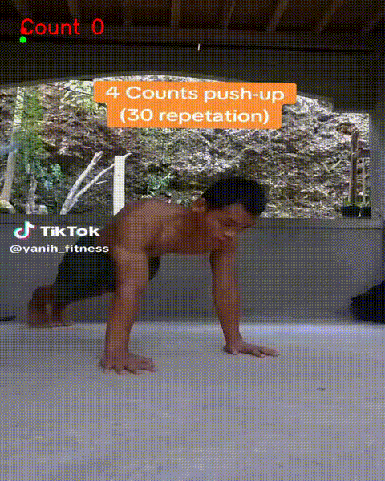

# Count push ups with Mediapipe

 <h1 align="center">Counting Push Up</h1>

## Descriptions
* Developed a system using MediaPipe to detect body keypoints in a video of push-up exercises, automatically counting the number of push-ups performed based on the detected motion.

  

   
  <i>Demo</i>

